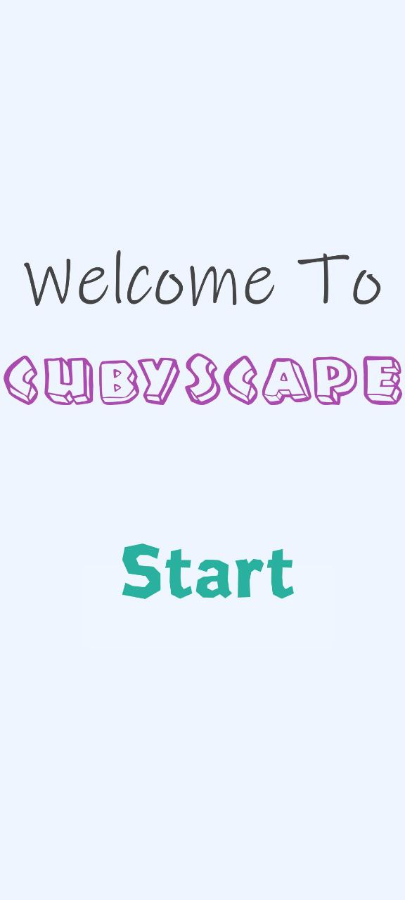
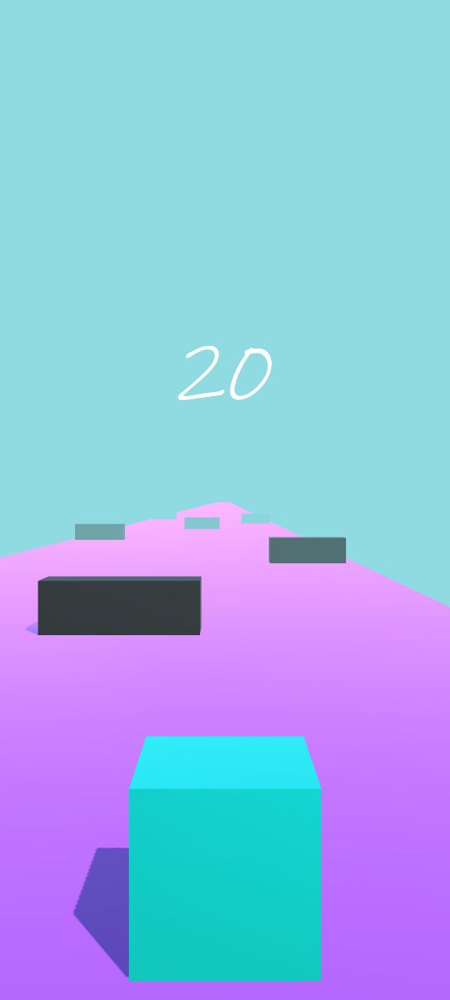
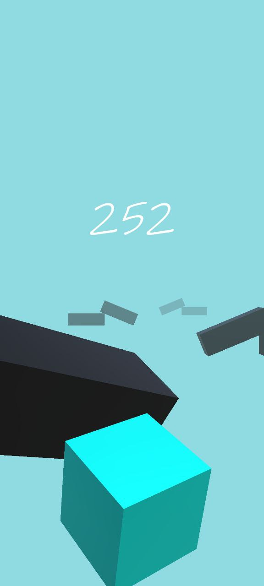
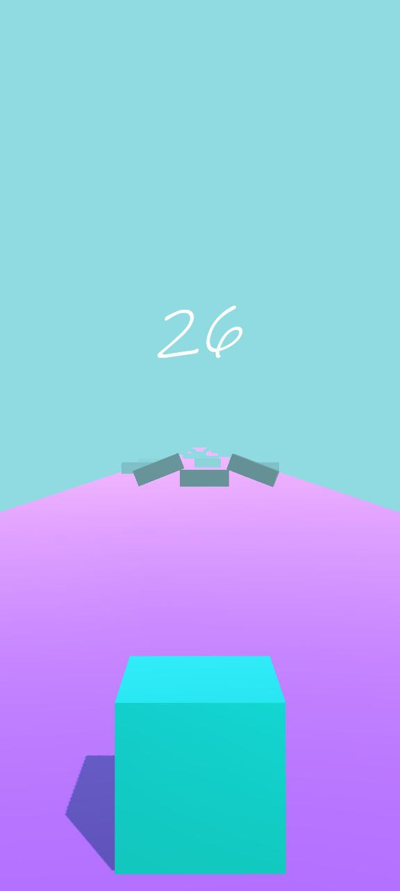
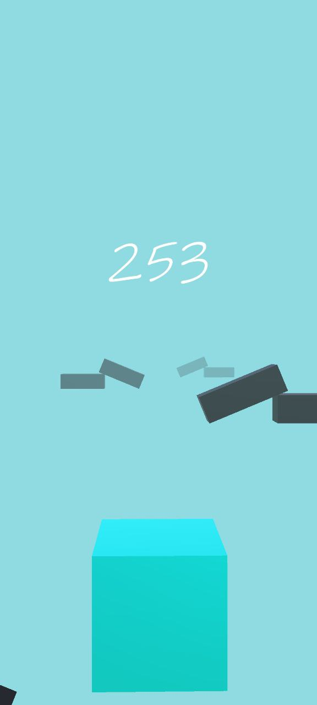

# Cubyscape - Android Game

Welcome to Cubyscape, a simple Android game created using Unity.

## Installation

To install Cubyscape on your Android device, follow these simple steps:

1. **Download the APK**: Locate the "Cubyscape.apk" file in this repository. You can find it in folder "Game APK" Share it to your Android Device.

2. **Enable Unknown Sources**:

   - Open your Android device's settings.
   - Navigate to the "Security" or "Privacy" settings (the exact name may vary depending on your device).
   - Enable the "Unknown sources" option. This allows you to install apps from sources other than the Google Play Store.

3. **Install Cubyscape**:

   - Use a file manager app to find the downloaded "Cubyscape.apk" file.
   - Tap on the APK file to start the installation process.

4. **Launch the Game**:
   - Once the installation is complete, you can find the Cubyscape game icon in your app drawer.
   - Tap on the icon to start playing.

## Gameplay

Cubyscape is a straightforward game, and there are no complicated instructions. Simply launch the game, and you'll be able to play immediately.

### Gameplay Instructions

- Press on Left side of screen to move Cube to Left.
- Press on Right side of Screen to move Cube to Right.
- Avoid Obstacles or falling down and Reach the end line to Progress through Levels.
- Levels Difficulty Increase as you progress.

Enjoy the simple gaming experience!

## Screenshots

  
  
  

  
  

## License

This project is provided under the [MIT License](./LICENSE). You are free to use, modify, and distribute it in compliance with the license terms.

Happy gaming!
